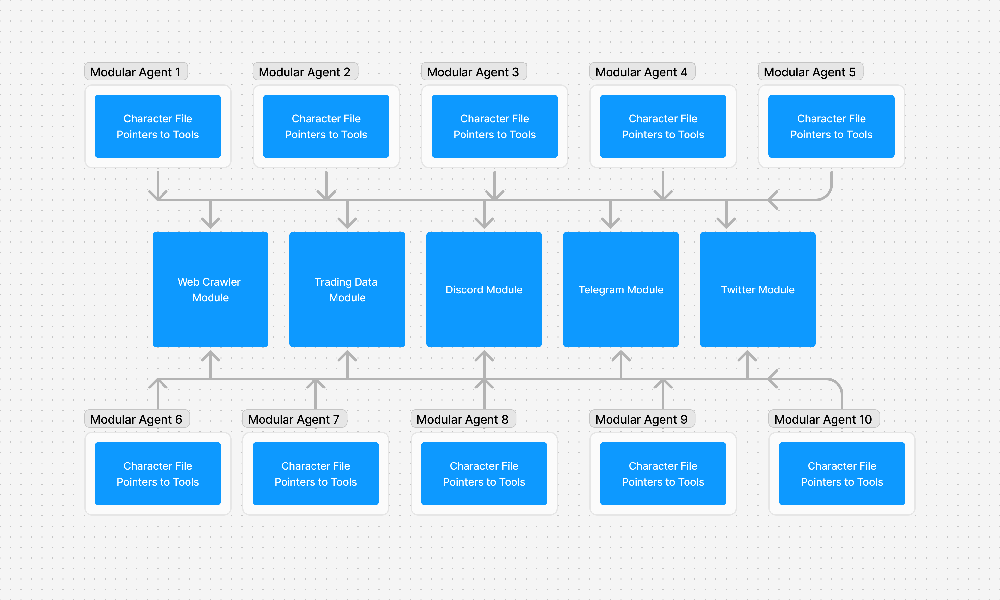

# Core Concepts

## Identity File
A Daemon Identity file is extremely light weight. Most of the "dynamic" nature of a Daemon comes from the servers it connects to and the tools they provide. Each server can track messages/data and provide it's own context and tooling to the daemon. 

```
Name: Daemon Name
Pubkey: A solana public key that the Daemon uses to sign approvals
Model Settings: Generation Model name/api url/api key
Identity Prompt: A small description of who the agent is
Identity Server URL: An Identity MCP server that tracks all logs for the Agent and stores the character file so it can be retrieved.
Bootstrap: A list of servers to connect to on Daemon start and any tools to call during startup
```

## Adding MCP Servers
Beyond bootstrapping during initialization, servers can be registered and deregistered with the Daemon at any time through addMCPServer() and removeMCPServer() methods. These methods dynamically get tools manifest from the server and add it to the Daemon's tool map.

## Daemon MCP Servers

Many Daemons can connect to the same Daemon Tool Server, allowing scalable architecture where thousands of agents could run and be using the same tools . 



Servers can provide four different types of tools:

1. Server Tools
    Server tools are *not* called during the message lifecycle, and instead are called on-demand. Examples of these types of tools are registration tools (such as those called on the Identity Server during instancing) or a transaction submission tool that has the Daemon submit a signed payload to a server to have it processed.

2. Context Tools
    Context tools are the first set of tools to be called during the message lifecycle. 
    They are used to add additional context (like memories or price data for token, or whatever else)
    Context servers can also fill out a list of tools the LLM might make use of in the Actions step to give it context around that

3. Action Tools
    Actions tools are called to take the generated text and then take actions on it (like creating a transaction for buying a token).

4. Post Process Tools
    Post Process Tools are the last set of tools to be called and they do things like create new memories based on generated text + actions taken.

<div class="callout">
    One thing to note is that each step (Context, Action, Post Process) calls all of the tools of that type from all of the servers registered to that Daemon.
    This means that if you want to *not* run a particular tool for a given input, it's up to the *tool* to figure out if it should be run or not. Check out [common patterns](./FAQ.md) 
    on how to accomplish this with individual tool checks or through a Server Router pattern.
</div>

### Message Lifecycle
Currently, Daemon only supports text input and output through the message() function right now, but it's on the roadmap to add multimodal capabilities in the future. 
A message can be sent with the following arguments:

```
message: The User's message
opts (optional) 
    channelId (optional) A unique ID for the "room" the agent is talking in. Useful for knowledge/memory systems to retrieve memory only for that room
    context (optional) True/False (defaults true) Do you want to fetch additional context (like memory) from any context tools of the server(s) connected
    actions (optional) True/False (defaults true) Do you want to fetch any actions from contected server(s) (like being able to post on Twitter)
    postProcess (optional) True/False (defaults true) Do you want to post process the message with all connected servers (like being able to create new memories from the input message)
    toolArgs (optional) `serverUrl-toolName` -> any{} when calling any of the tools, do you want to pass in any special arguments
```

The lifecycle object looks like this:

```
daemonPubkey: the Daemon's Identity Keypair
daemonName: the name of the Daemon
messageId: a unique ID for the message
message: the USER INPUT
createdAt: the timestamp for when the message came in
approval: a signature from the Daemon that includes (message, createdAt, messageId, and channelId) that proves that the message is being sent to a server from the Daemon
channelId: an optional "room" id that separates context for the Daemon's messages
identityPrompt: the Daemon's identity prompt
context: A list of strings of context gotten after calling the various context tools
output: The LLM output of feeding it User Input + Context + Tools
tools: a list of tools that context servers let the llm know what it can do
hooks: a list of server web hooks that Daemon should call after the action step (such as signing and sending back a signed transaction)
hooksLog: a list of hooks that were requested, used for logging
actionsLog: a list of actions that were taken, used for logging
postProcessLog: a list of post processes that were done, used for logging 
```

The Daemon will:

1. Get a message on the message() function
2. Generate and sign an approval payload which includes (message, createdAt, messageId, and channelId) and send it along. This is to prevent people from spoofing payloads to servers.
3. If context is true, then it'll call all the context tools in parallel to fill it's context and tools arrays with memories and tools registries it can use
4. Call generateText() using the provided LLM, feed it the User Input + Context + Tools and store the output in output
5. If actions is true, call the various action tools, which will either do some action on the Daemon's behalf or send back a hook that the Daemon should call after using an internal tool.
    - Currently the only internal tool available is 'sign' which signs a payload and returns it
6. If post process is true, the Daemon will then call post process tools to create new memories and logs as needed.
7. Finally the Daemon will return the full lifecycle object to the caller

## Hooks & Internal Tools

When a Daemon is calling an Action Tool, it's possible that some additional information might be needed. There's a requirement for Server to be able to *request* something from the Daemon and have the Daemon reply. But the message lifecycle doesn't really accommodate this, that's why we have the hooks system. A hook allows a server action to request the Daemon use an internal tool (like sign payload for a prepared transaction) and then call the server back through a server tool like a web hook.

Hook Objects look like this

```
originServerUrl: The server that registered the hook
daemonTool: The internal Daemon function/tool to call. Currently the only one available is "sign" but could have more in the future
daemonArgs: any args you need to send the internal tool (like payload for 'sign')
hookTool:
    hookServerUrl: MCP Server to call with the result of the internal function. Likely will be the same as originServerUrl, but could be different
    toolName: The MCP Tool to call on the above server
    toolArgs: any args along with the internal daemon Tool output you want to send along to the hook tool. The final object will be a merge of the two.
```